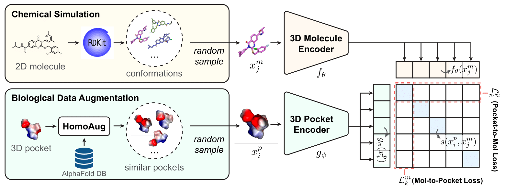

# DrugCLIP: Contrastive Protein-Molecule Representation Learning for Virtual Screening

[](https://github.com/xxxx/blob/main/LICENSE)
[](https://arxiv.org/pdf/2310.06367.pdf)

<!-- [[Code](xxxx - Overview)] -->



Official code for the paper "DrugCLIP: Contrastive Protein-Molecule Representation Learning for Virtual Screening", accepted at *Neural Information Processing Systems, 2023*. **Currently the code is a raw version, will be updated ASAP**. If you have any inquiries, feel free to contact billgao0111@gmail.com

# Requirements

same as [Uni-Mol](https://github.com/dptech-corp/Uni-Mol/tree/main/unimol)

**rdkit version should be 2022.9.5**

## Data and checkpoints

https://drive.google.com/drive/folders/1zW1MGpgunynFxTKXC2Q4RgWxZmg6CInV?usp=sharing

It currently includes the train data, the trained checkpoint and the test data for DUD-E


### Training data

The dataset for training is included in google drive: train_no_test_af.zip. It contains several files:

```

dick_pkt.txt: dictionary for pocket atom types

dict_mol.txt: dictionary for molecule atom types

train.lmdb: train dataset

valid.lmdb: validation dataset

```

Use py_scripts/lmdb_utils.py to read the lmdb file. The keys in the lmdb files and corresponding descriptions are shown below:

```

"atoms": "atom types for each atom in the ligand" 

"coordinates": "3D coordinates for each atom in the ligand generated by RDKit. Max number of conformations is 10"

"pocket_atoms": "atom types for each atom in the pocket"

"pocket_coordinates": "3D coordinates for each atom in the pocket"

"mol": "RDKit molecule object for the ligand"

"smi": "SMILES string for the ligand"

"pocket": "pdbid of the pocket",
```


The dataset is compiled from the PBDBind dataset, containing a combination of authentic protein-ligand complexes and those generated through HomoAug, a technique for augmenting data with homology-based transformations.


### Test data

#### DUD-E

```
DUD-E
├── gene id
│   ├── receptor.pdb
│   ├── crystal_ligand.mol2
│   ├── actives_final.ism
│   ├── decoys_final.ism
│   ├── mols.lmdb (containing all actives and decoys)
│   ├── pocket.lmdb

```

#### PCBA

```
lit_pcba
├── target name
│   ├── PDBID_protein.mol2
│   ├── PDBID_ligand.mol2
│   ├── actives.smi
│   ├── inactives.smi
│   ├── mols.lmdb (containing all actives and inactives)
│   ├── pocket.lmdb

```


### Data preprocessing

see py_scripts/write_dude_multi.py

## HomoAug

Please refer to HomoAug directory for details

## Train

bash drugclip.sh

## Test

bash test.sh


## Retrieval 

bash retrieval.sh

In the google drive folder, you can find example file for pocket.lmdb and mols.lmdb under retrieval dir.


## Citation

If you find our work useful, please cite our paper:

```bibtex
@inproceedings{gao2023drugclip,
    author = {Gao, Bowen and Qiang, Bo and Tan, Haichuan and Jia, Yinjun and Ren, Minsi and Lu, Minsi and Liu, Jingjing and Ma, Wei-Ying and Lan, Yanyan},
    title = {DrugCLIP: Contrasive Protein-Molecule Representation Learning for Virtual Screening},
    booktitle = {NeurIPS 2023},
    year = {2023},
    url = {https://openreview.net/forum?id=lAbCgNcxm7},
}
```
